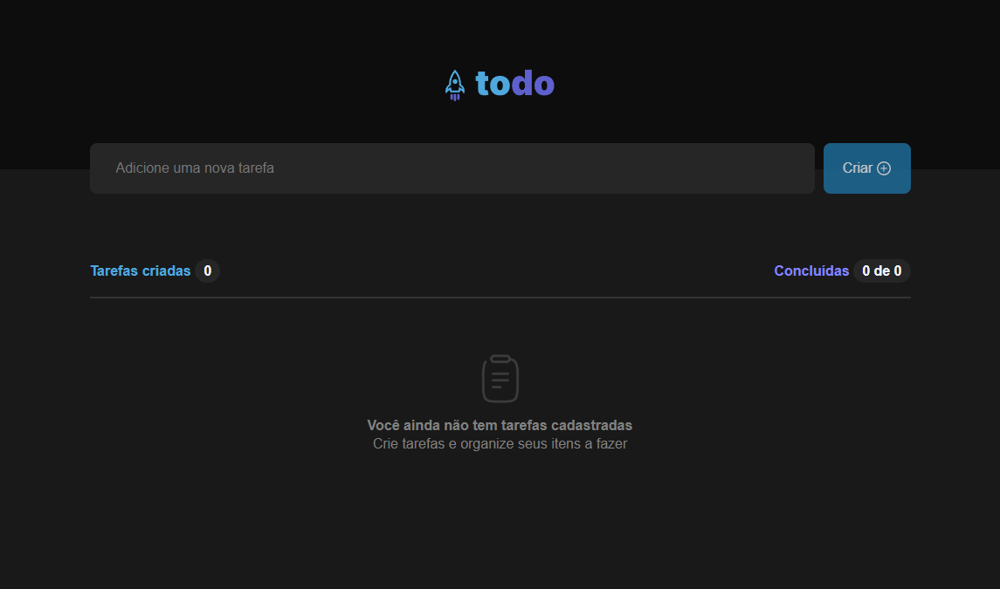

# ✅ ToDo List

Uma aplicação simples de lista de tarefas desenvolvida com **React**, permitindo que usuários adicionem, concluam e removam tarefas do dia a dia de forma prática e intuitiva.

> 🌐 Acesse o projeto online: [Todo List](https://vercel.com/marcelobueno25s-projects/todo-list)

## 📸 Capturas de tela

 <!-- Altere ou adicione uma imagem do jogo se desejar -->

---


## ✨ Funcionalidades

- ✅ Adicionar tarefas
- 📋 Visualizar lista de tarefas
- ✏️ Marcar tarefas como concluídas
- ❌ Remover tarefas da lista
- 💾 Armazenamento local (LocalStorage)

## 🛠 Tecnologias Utilizadas

- [React](https://reactjs.org/)
- [Vite](https://vitejs.dev/)
- [JavaScript](https://developer.mozilla.org/pt-BR/docs/Web/JavaScript)
- [CSS Modules](https://github.com/css-modules/css-modules)
- [LocalStorage](https://developer.mozilla.org/pt-BR/docs/Web/API/Window/localStorage)

## 📦 Instalação e Execução Local

Para rodar o projeto localmente, siga os passos abaixo:

1. **Clone o repositório:**

```bash
git clone https://github.com/marcelobueno25/todo.list.git
cd todo.list
npm install
npm run dev

